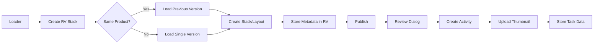

# AYON Review Submitter

[](https://ynput.io/ayon/)
[](https://opensource.org/licenses/Apache-2.0)
[](https://github.com/kyadarimahesh/ayon-review-submitter/releases)

A powerful AYON addon that streamlines the review submission workflow by integrating OpenRV for intelligent version comparison and automated review tracking.

## 🎯 Features

### Core Capabilities
- **🔄 Smart Version Comparison**: Automatically compares current version with previously reviewed version of the same product
- **📊 OpenRV Stack Creation**: Creates side-by-side stacks and multi-view layouts for efficient comparison
- **💬 Review Submission Dialog**: Intuitive Qt interface for submitting reviews with reviewer selection, submission types, and priority flags
- **📸 Automatic Thumbnails**: Extracts first frame from RV and uploads to AYON version
- **📝 Activity Tracking**: Creates AYON activity comments with user tagging and high-priority markers
- **💾 Metadata Storage**: Tracks loaded products and submission history in task data
- **⚙️ Fully Configurable**: All product filters, task settings, and submission options configurable via AYON server settings

### Workflow Integration
```
Loader → Create RV Stack → Auto-Compare → Publish → Review Dialog → Activity + Thumbnail + Task Data
```

## 📋 Requirements

- **AYON Server**: >=1.8.4,<2.0.0
- **AYON Core**: Latest
- **OpenRV**: Installed and accessible
- **Python**: python = >=3.9.1,<3.10
- **Qt**: PySide2/PySide6 or PyQt5/PyQt6

## 🚀 Installation

### Method 1: AYON Server UI (Recommended)
1. Download the latest release `.zip` from [Releases](https://github.com/kyadarimahesh/ayon-review-submitter/releases)
2. Open AYON Server UI
3. Navigate to **Studio Settings → Addons**
4. Click **Upload Addon**
5. Select the downloaded `.zip` file
6. Enable the addon for your projects

### Method 2: Manual Installation
```bash
# Clone the repository
git clone https://github.com/kyadarimahesh/ayon-review-submitter.git
cd ayon-review-submitter

# Create package
python create_package.py

# Upload package/review_submitter-0.0.1.zip to AYON server
```

## ⚙️ Configuration

### Server Settings

Navigate to **Studio Settings → Addons → Review Submitter** to configure:

#### Product Type Filters
- **First Submission Filters**: Product types for initial submission (default: `["plate"]`)
- **Review Target Product Types**: Product types for review targets (default: `["render"]`)
- **Auto-Compare Product Types**: Product types that trigger auto-comparison (default: `["render", "prerender", "plate"]`)

#### Task Settings
- **Input Linked Task Names**: Task names to include in loader filter (default: `["Ingest"]`)

#### Submission Settings
- **Auto-submit on Publish**: Automatically show review dialog after publish (default: `false`)
- **Default Reviewers**: Pre-populate reviewer list
- **Require Comment**: Make comment mandatory (default: `true`)
- **Submission Types**: Available submission types (default: `["WIP", "FINAL", "PACKAGE"]`)

## 📖 Usage

### Basic Workflow

#### 1. Load Versions for Review
1. Open **Loader** in your DCC (or standalone)
2. Select version(s) to review
3. Right-click → **Create RV Review Stack**
4. OpenRV launches with versions loaded

#### 2. Auto-Comparison
If you load a version of a product that was previously reviewed:
- The addon automatically loads the last reviewed version
- Creates a stack for side-by-side comparison
- Displays: `Comparing renderMain v003 with v002`

#### 3. Submit Review
1. After reviewing in RV, trigger **Publish** (or use automated workflow)
2. Review Submission Dialog appears
3. Fill in:
   - **Reviewer**: Select from AYON users
   - **Submission Type**: WIP / FINAL / PACKAGE
   - **High Priority**: Check if urgent
   - **Comment**: Add review notes
4. Click **Submit Review to AYON**

#### 4. Result
- ✅ Activity comment created on version with user tagging
- ✅ First frame thumbnail uploaded to version
- ✅ Submission data stored in task data for future comparisons
- ✅ Success notification displayed

### Advanced Usage

#### Custom Loader Integration
```python
from review_submitter.handlers import OpenRVStackHandler

# Load multiple contexts
contexts = [context1, context2, context3]
success = OpenRVStackHandler.create_auto_stack(contexts)
```

#### Programmatic Review Submission
```python
from review_submitter.handlers import ReviewSubmissionHandler

# Trigger publish and review workflow
ReviewSubmissionHandler.trigger_publish_and_review(parent_widget)
```

#### Access Loaded Products Data
```python
from review_submitter.handlers import OpenRVStackHandler

# Get currently loaded products in RV
loaded_products = OpenRVStackHandler.get_loaded_products_data(project_name)
# Returns: {product_id: {version_id, version_name, product_name, product_type}}
```

## 🏗️ Architecture

### Components

```
ayon-review-submitter/
├── client/review_submitter/
│   ├── handlers/
│   │   ├── openrv_handler.py          # RV stack creation & metadata
│   │   ├── review_submission_handler.py # Review dialog & workflow
│   │   └── settings_helper.py         # Settings retrieval
│   ├── plugins/submitter/
│   │   └── create_rv_review_stacks.py # Loader plugin
│   ├── addon.py                       # Addon registration
│   └── version.py                     # Version info
└── server/
    └── settings/
        └── main.py                    # Server settings schema
```

### Data Flow



### Metadata Storage

#### RV Source Nodes
```python
{
    "ayon.version_id": "uuid",
    "ayon.representation_id": "uuid",
    "ayon.file_path": "/path/to/file.exr"
}
```

#### Task Data (submission_data)
```python
{
    "submission_type": "WIP",
    "reviewer_name": "john.doe",
    "submitter_name": "jane.smith",
    "workfile_version_id": "uuid",
    "submitted_at": "2024-12-20 14:30:00",
    "loaded_products": {
        "product_uuid": {
            "version_id": "version_uuid",
            "version_name": "v003",
            "product_name": "renderMain",
            "product_type": "render"
        }
    }
}
```

## 🔧 API Reference

### OpenRVStackHandler

#### `create_auto_stack(contexts)`
Creates RV stack/layout for given contexts with auto-comparison.

**Parameters:**
- `contexts` (list): List of context dictionaries

**Returns:**
- `bool`: True if successful

**Example:**
```python
contexts = [
    {
        "project": {"name": "MyProject"},
        "version": {"id": "v1", "name": "v001"},
        "product": {"id": "p1", "name": "renderMain", "productType": "render"},
        "representation": {...}
    }
]
OpenRVStackHandler.create_auto_stack(contexts)
```

#### `get_loaded_products_data(project_name)`
Retrieves loaded products from current RV session.

**Parameters:**
- `project_name` (str): AYON project name

**Returns:**
- `dict`: {product_id: {version_id, version_name, product_name, product_type}}

### ReviewSubmissionHandler

#### `trigger_publish_and_review(parent)`
Triggers publish workflow with post-publish review dialog.

**Parameters:**
- `parent` (QWidget): Parent widget for dialog

#### `collect_review_inputs(parent, is_resubmission=False)`
Opens loader with filtered product types for review input collection.

**Parameters:**
- `parent` (QWidget): Parent widget
- `is_resubmission` (bool): If True, uses review_target filters only

### Settings Helper

#### `get_addon_settings()`
Retrieves addon settings with fallback to defaults.

**Returns:**
- `dict`: Complete settings dictionary

#### `get_product_filters()`
Gets product type filter settings.

**Returns:**
- `dict`: {first_submission_filters, review_target_product_types, auto_compare_product_types}

#### `get_task_settings()`
Gets task-related settings.

**Returns:**
- `dict`: {inputs_linked_tasks}

#### `get_submission_settings()`
Gets submission-related settings.

**Returns:**
- `dict`: {auto_submit_on_publish, default_reviewers, require_comment, submission_types}

## 🐛 Troubleshooting

### RV Not Loading
**Issue**: "RV module not available"
**Solution**: 
- Ensure OpenRV is installed
- Check RV is in system PATH
- Verify AYON OpenRV addon is enabled

### No Auto-Comparison
**Issue**: Previous version not loading automatically
**Solution**:
- Check product type is in `auto_compare_product_types` setting
- Verify task has `submission_data` from previous review
- Ensure same `product_id` was reviewed before

### Settings Not Applied
**Issue**: Using default values instead of server settings
**Solution**:
- Verify addon is enabled in project settings
- Check settings are saved in Studio Settings
- Restart AYON launcher/DCC

### Thumbnail Not Uploading
**Issue**: No thumbnail on version after review
**Solution**:
- Ensure RV session is active during submission
- Check RV can export frames (test with File → Export)
- Verify AYON server has write permissions

## 🤝 Contributing

Contributions are welcome! Please:

1. Fork the repository
2. Create a feature branch (`git checkout -b feature/amazing-feature`)
3. Commit your changes (`git commit -m 'Add amazing feature'`)
4. Push to the branch (`git push origin feature/amazing-feature`)
5. Open a Pull Request


## 📝 License

This project is licensed under the Apache License 2.0 - see the [LICENSE](LICENSE) file for details.

## 🙏 Acknowledgments

- AYON Team for the amazing pipeline platform
- OpenRV community for the powerful review tool
- Contributors and testers

## Support

- **Issues**: [GitHub Issues](https://github.com/kyadarimahesh/ayon-review-submitter/issues)


## 🗺️ Roadmap

See [CHANGELOG.md](CHANGELOG.md) for version history and future plans.

### Upcoming Features
- [ ] Configurable comparison rules per project

---

**Made with ❤️ for the AYON community**
